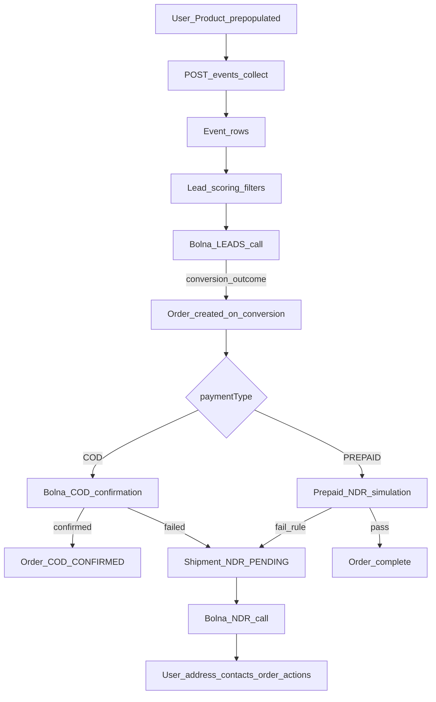

# End-to-end event → lead → order → COD/NDR flow

## Target flow (your spec)



**Your decisions (locked in):**
- **Orders** are created **only** from a successful **LEADS** Bolna conversion (not from payment/checkout completion events on ingest).
- **Lead pool**: skip users who already have a **payment or checkout completion** event — we only dial prospects, not customers who already paid.
- **Prepaid NDR simulation**: env-configurable rate (default 25%), applied **immediately** on order create; until **5** prepaid orders have been sent to NDR, **every** new prepaid order fails; after that, use the random rate.

---

## Current state vs target (gap matrix)

| Stage | Today | Gap |
|-------|--------|-----|
| Event API | [`POST /api/events/shopify`](src/app/api/events/shopify/route.ts) | No `/api/events/collect`; no auth; creates users on ingest |
| Product | **No `Product` model** — only `productSummary` strings on `Order`/`Shipment` | Add `Product` + link events/orders |
| Strict refs | Events optional `userId`; anonymous events allowed | Require existing `userId` + `productId`; reject unknown refs |
| Lead filter | [`lead-query.ts`](src/lib/lead-query.ts) excludes `purchase_completed` only | Expand to **all payment/checkout completion event names** (hard exclude from list + dialer); events still stored for analytics |
| Lead Bolna | [`lead-trigger-call.ts`](src/lib/lead-trigger-call.ts) + dialer | Works; no webhook side effects |
| Order create | Only manual [`POST /api/cod/shipments`](src/app/api/cod/shipments/route.ts) | **LEADS webhook** must create `Order` on conversion |
| COD calls | [`cod-trigger-call.ts`](src/lib/cod-trigger-call.ts) + dialer | Works for `paymentType: COD` |
| COD outcomes | [`bolna-webhook`](src/app/api/bolna-webhook/route.ts): `completed` ⇒ always `COD_CONFIRMED` | Must use structured `outcome` / `reason` for confirm vs fail |
| COD fail → NDR | Webhook creates/updates `Shipment` | Mostly done; tighten reason mapping |
| Prepaid → NDR | Not implemented | New service + env vars + counter |
| NDR actions | Outcome → shipment status in [`ndr.ts`](src/lib/ndr.ts) | Missing: write-back to `User` (address, secondary address/phone), cancel order, reschedule `Order.expectedDeliveryDate` |
| LEADS webhook | No `OpsSegment.LEADS` branch | **Critical** — conversion + order pipeline entry |

---

## Phase 1 — Data model and strict ingest

### 1.1 Add `Product` and tighten relations

Update [`prisma/schema.prisma`](prisma/schema.prisma):

- **`Product`**: `id`, `sku` (unique), `name`, `price`, optional `shopifyProductId`, timestamps.
- **`Event`**: add required `productId` (FK → `Product`) once migration path is clear; keep `userId` required for accepted events.
- **`Order`**: add optional `productId` FK; keep `productSummary` for Bolna prompts (denormalized from `Product`).
- **`User`**: add `address`, `addressShort`, `secondaryAddress`, `secondaryPhone` for NDR write-backs.
- **`Shipment`**: optional `secondaryPhone`, `secondaryAddress`; optional FK `orderRowId` → `Order.id` (in addition to string `orderId` ref) for reliable cancel/reschedule.

Seed [`prisma/seed.ts`](prisma/seed.ts): prepopulate products + users; events reference both.

### 1.2 Collect events API (strict)

- Add [`src/app/api/events/collect/route.ts`](src/app/api/events/collect/route.ts) (alias or successor to shopify route).
- Refactor [`src/lib/shopify-events.ts`](src/lib/shopify-events.ts) → shared `ingestEvents()`:
  - Resolve user by `user_id` / `shopifyCustomerId` / email / phone — **lookup only, no create**.
  - Resolve product by `product_id` / `sku` in payload — **lookup only**.
  - If user or product missing → count as `rejected` with reason (do not insert orphan events).
  - Persist `productId` on `Event`; store full normalized payload in `properties`.
- Optional: keep `/api/events/shopify` as thin wrapper calling same ingest for backward compatibility.
- Optional ingest auth: `EVENTS_API_KEY` header (document in README).

---

## Phase 2 — Lead pipeline (unchanged trigger, new conversion exit)

### 2.1 Already-converted exclusion (payment / checkout done)

Users who have **already paid or finished checkout** must never appear as leads or receive LEADS Bolna calls. Ingest still accepts these events (for funnel analytics), but [`lead-query.ts`](src/lib/lead-query.ts) and the lead dialer must **hard-skip** them.

Add to [`src/lib/constants.ts`](src/lib/constants.ts) a shared set, e.g. `LeadExclusionEventNames`, normalized to lowercase when matching:

| Canonical name | Aliases to accept (normalize `eventName`) |
|----------------|-------------------------------------------|
| `purchase_completed` | `purchase_completed`, `payment_completed`, `payment_done` |
| `checkout_completed` | `checkout_completed`, `checkout_done` |

**Rule in `computeLeadScore` / lead list loop:**

```ts
// If ANY event in the lookback window matches LeadExclusionEventNames → exclude user
if (alreadyConverted) continue; // before score/intent filters
```

- Do **not** create `Order` from these events (orders remain LEADS-call conversion only).
- Still exclude users with an existing **open** `Order` from LEADS dialer (post-conversion via voice) as a secondary guard.
- `CHECKOUT_COMPLETED` can remain a high positive score for *non-converted* users who started checkout but did not pay; only the **completion/payment** names above trigger exclusion.
- Optionally boost score when recent `product_viewed` matches dialer filter product SKU (for non-excluded users only).
- Pass `leadScore` from [`lead-dialer.ts`](src/lib/lead-dialer.ts) into `triggerLeadCall`.

**Ingest note:** completion events are valid on the collect API; they simply disqualify the user from the lead segment until you define a reset rule (out of scope unless requested).

### 2.2 Bolna LEADS agent contract

Add `docs/bolna-leads-agent-prompt.md` (mirror NDR doc) requiring extracted fields on terminal webhook:

- `outcome`: `CONVERSION` | `NOT_INTERESTED` | `CALLBACK` | `NO_ANSWER`
- `payment_type`: `COD` | `PREPAID`
- `order_amount`, `address`, `address_short`, `product_sku` or `product_id`
- `expected_delivery_date` (optional)

Extend [`CallOutcome`](src/lib/constants.ts) with LEADS-specific values (or a separate `LeadCallOutcome` enum used only in LEADS branch).

---

## Phase 3 — Order creation from LEADS webhook (your chosen path)

New module [`src/lib/order-from-lead.ts`](src/lib/order-from-lead.ts):

- `createOrderFromLeadConversion(call, extracted)`:
  - Idempotent on `orderRef` derived from `lead_call_id` + user + product (or explicit `order_ref` from agent).
  - Load `User` + `Product`; build `Order` with `status: COD_PENDING` (or `PREPAID_PENDING` if you add it).
  - Link `Call.orderId`.
  - Emit internal metric/log for conversion.

In [`src/app/api/bolna-webhook/route.ts`](src/app/api/bolna-webhook/route.ts), add **`OpsSegment.LEADS`** branch when terminal:

| Outcome | Action |
|---------|--------|
| `CONVERSION` + valid fields | `createOrderFromLeadConversion` → branch by `paymentType` |
| `NOT_INTERESTED` / `NO_ANSWER` | Update call only |
| `CALLBACK` | Mark user/lead for retry (optional `Lead` status field or tag on latest call) |

After order create:

- **COD** → enqueue for existing COD dialer ([`cod-dialer.ts`](src/lib/cod-dialer.ts)) — may trigger immediately or on next tick.
- **PREPAID** → run prepaid NDR simulation (Phase 5).

---

## Phase 4 — COD confirmation flow (fix outcomes)

### 4.1 COD webhook logic

Refactor COD block in [`bolna-webhook/route.ts`](src/app/api/bolna-webhook/route.ts):

- **Do not** treat all `status === "completed"` as confirmed.
- Map extracted `outcome` / `reason`:
  - Confirmed → `Order.status = COD_CONFIRMED` (no NDR shipment).
  - Rejected / wrong address / unreachable / callback → existing `mapCodFailureToStatus` + `mapCodReasonToNdrReason` → upsert `Shipment` (already present ~L143–183).
- Persist `Call.outcome` for COD same as NDR.

Add `docs/bolna-cod-agent-prompt.md` with explicit outcomes aligned to [`CodFailureReason`](src/lib/constants.ts).

### 4.2 COD dialer for prepaid orders

[`cod-dialer.ts`](src/lib/cod-dialer.ts) correctly filters `paymentType: COD` only — prepaid orders skip COD calls (by design).

---

## Phase 5 — Prepaid simulated NDR (env + min-5 rule)

New [`src/lib/prepaid-ndr-simulation.ts`](src/lib/prepaid-ndr-simulation.ts):

**Env vars** (document in `.env.example`):

- `PREPAID_NDR_FAILURE_RATE` (default `0.25`)
- `PREPAID_NDR_MIN_FORCED_FAILURES` (default `5`)

**Algorithm** on prepaid `Order` create (called from LEADS webhook after order insert):

1. Count existing prepaid NDR shipments (or orders with `status` indicating simulated failure) — `forcedCount`.
2. If `forcedCount < PREPAID_NDR_MIN_FORCED_FAILURES` → **always** create `Shipment` with `paymentType: PREPAID`, `ndrReason: PREPAID_SIMULATED_FAILURE` (new reason constant), `status: NDR_PENDING`.
3. Else if `Math.random() < PREPAID_NDR_FAILURE_RATE` → same shipment create.
4. Else → mark order delivered/complete state (e.g. `PREPAID_FULFILLED` or reuse `COD_CONFIRMED` analogue for prepaid).

Reuse existing NDR dialer ([`trigger-call.ts`](src/lib/trigger-call.ts)) — no separate prepaid agent required.

---

## Phase 6 — NDR outcomes → user + order mutations

Extend NDR webhook branch (after `mapOutcomeToShipmentStatus`):

| Outcome | Shipment | User | Order |
|---------|----------|------|-------|
| `ADDRESS_UPDATE` | Update `address` / `addressShort` from `Call.addressUpdate` | If “replace primary” → update `User.address`; else set `User.secondaryAddress` | Sync `Order.address` if linked |
| New: `SECONDARY_CONTACT` (agent + constant) | Set `secondaryPhone` | `User.secondaryPhone` | — |
| `RESCHEDULE` | `RESCHEDULED` | — | Set `Order.expectedDeliveryDate` from slot / extracted date |
| `RTO_CONFIRMED` | `RTO_CONFIRMED` | — | `Order.status = COD_CANCELLED` (or `CANCELLED`) |
| `REATTEMPT_CONFIRMED` | Status + keep `NDR_PENDING` for re-dial | — | — |

Update [`docs/bolna-agent-prompt.md`](docs/bolna-agent-prompt.md) with secondary contact + primary vs secondary address instructions.

UI: show `addressUpdate` / secondary fields in [`ShipmentDetail.tsx`](src/components/ShipmentDetail.tsx).

---

## Phase 7 — Wiring, ops, and validation

- **Dialer runner** ([`dialer-runner.ts`](src/lib/dialer-runner.ts)): no change to tick order; ensure new orders enter COD queue automatically.
- **Dev simulate**: add [`src/app/api/cod/[id]/simulate/route.ts`](src/app/api/cod/[id]/simulate/route.ts) mirroring NDR simulate for COD webhook testing.
- **Docs**: update [`docs/agent-context.md`](docs/agent-context.md) and [`.cursor/skills/project-memory/SKILL.md`](.cursor/skills/project-memory/SKILL.md) with the canonical flow diagram above.
- **Validation**: `npx tsc --noEmit`; `npx prisma db push` + `generate`; manual script or Postman sequence:
  1. Seed users/products
  2. POST collect events → leads appear
  3. Trigger LEADS call → simulate webhook `CONVERSION` → Order created
  4. COD call → fail → NDR shipment
  5. Prepaid conversion × 6 → first 5 NDR, ~25% thereafter

---

## Implementation order (recommended)

1. Schema + seed (Product, User fields, Event.productId)
2. Strict `ingestEvents` + `/api/events/collect`
3. Lead exclusion constants + `lead-query` / dialer guard (payment/checkout done)
4. LEADS webhook + `order-from-lead.ts`
5. COD outcome-based webhook fix + agent doc
6. `prepaid-ndr-simulation.ts` + env
7. NDR write-back handlers + prompt/UI
8. Docs + simulate endpoints + typecheck

---

## Files touched (primary)

| Area | Files |
|------|--------|
| Schema/seed | `prisma/schema.prisma`, `prisma/seed.ts` |
| Ingest | `src/lib/shopify-events.ts` (or rename), `src/app/api/events/collect/route.ts` |
| Leads | `src/lib/lead-query.ts`, `src/lib/lead-dialer.ts`, `src/lib/constants.ts` |
| Orders | **new** `src/lib/order-from-lead.ts`, `src/lib/prepaid-ndr-simulation.ts` |
| Webhook | `src/app/api/bolna-webhook/route.ts`, **new** `src/lib/cod-outcomes.ts` (optional extract) |
| NDR | `src/lib/ndr.ts`, `src/components/ShipmentDetail.tsx` |
| Docs | `docs/agent-context.md`, `docs/bolna-*-agent-prompt.md` |

No changes to `results/` or benchmark artifacts.
